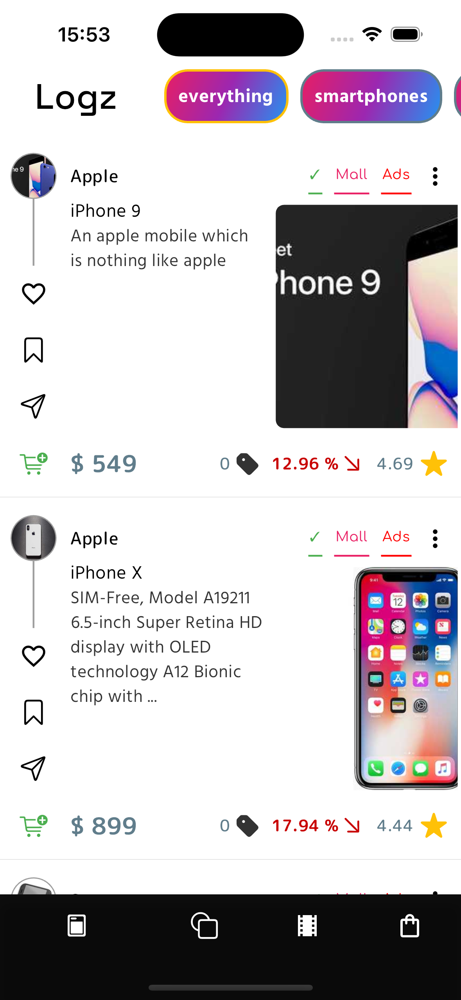

# E-Commerce App

An app - A marketplace with the UI look-like a social app, helping people to explore things to place orders. And Admin App designed to assist you in effortlessly managing and operating all aspects of your e-commerce business efficiently With a nice and user friendly UX/UI.

---

Features:

- Lazy loading. Saving local data.
- Like, Add to wishlist, Add to cart, Place Orders.
- Authentication, login, logout.

Technologies:

- Bloc - state management.
- Http - fetching data. + Firebase - authentication, storage.
- Hive - saving local data.
- Lottie - animate icon.

---

Pics Demo

  
  
  
  
  
  

